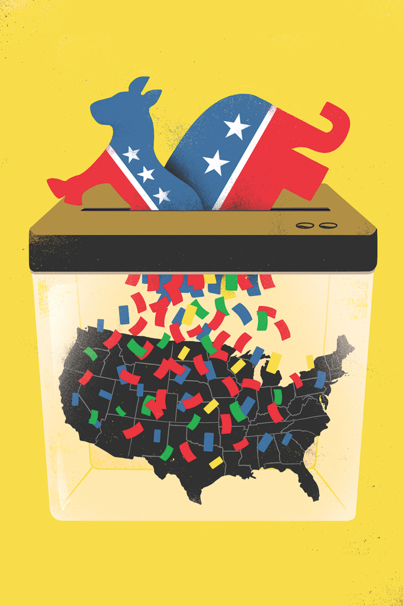
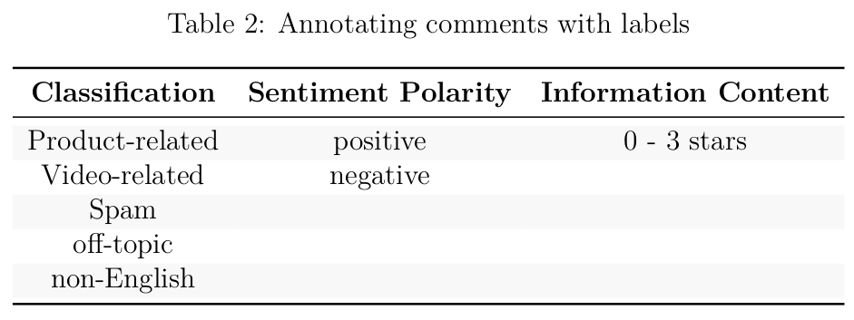

```{r setup, include=FALSE}
knitr::opts_chunk$set(echo = FALSE)
library(latexpdf)
library(data.table)
library(kableExtra)
library(magrittr)
```


# Case Study: Online approval rating for a political party  

## Reputation

> “It takes many good deeds to build a good reputation,
> and only one bad one to lose it.”  
> Benjamin Franklin

##  Background   

{width=50%}

- Distinctiveness 
- Policy decisions 
- High-ranking party members 

## Party Leader {.columns-2}

{width=70%}

- Overall Party image.  
  + leadership ability, 
  + decision-making  and 
  + sentiment towards person 


## Business Outcome  
- Perception 
- ex: Wuhan virus 
- Reputation $Vs.$ Reality

## Business Outcome
- Monitor response  

<center>
{width=70%}
</center>

## Evaluating Business Success {.columns-2}

{width=70%}

- Reputation improves  
- Reputation monitor  
  + Awareness
  + Accurate assessment of attitude
  

## Evaluating Business Success
* Pilot System
  + Party Organisation
  + Well-connected Members

## Strategic Plan for Machine Learning Adoption   
* Educate Executives    
* Viability of a reputation monitor  
    + Banking Sector   
* Reputation monitor for Fianna Fáil  
    + How Supervised Learning works

## Strategic Plan for Machine Learning Adoption   

* Training Data 
* Binary Classifier: 'positive' or 'negative'   
    + Confusion Matrix and ROC Curve  
* Ranking based on probability estimates  
* Benchmark
   +  __Political Social Media Posts__ dataset  

## Machine Learning Readiness

- PySpark  
- Pandas dataframes and Python libraries  
- Further training  

## Risk Management   
<center>     
{width=30%}
</center>
     
* Limited Domain Knowledge  

* Index to Rank Reputation  

* Activists 
  + high proportion of posts    

## Risk Management  
* Compiling Training Data 
    + Banking: One researcher and two research assistants   

* Non-response bias  

* Emotive / Inflammatory posts  

* Social Media Bias  

# Review of SenTube:  A Corpus for Sentiment Analysis  

## Summary 
* YouTube Posts  
  + text categorisation  
  + sentiment analysis  
  + tablets and automobiles  

<center>
{width=70%}
</center>

## Summary
- Twitter
- User Profile
- Single-document Labels

## Annotation Guidelines

* Accuracy and Consistency 
  + fixed set of options 
* Identity 
  + no qualitative dimensions 
    - attractiveness, convenience, durability

## Annotation Guidelines

* Standardisation 
  + level of agreement 
  + Krippendorff’s $\alpha$ coefficient
  + Recommend > 0.8   
  
* "a gold-standard sample"

* Single annotator
  + 208 videos and 36 thousand comments!

## Machine Learning Techniques  
* Labeling  
  + Supervised Learning   
  + Bias $Vs.$ Variance

* Baseline model  
  + "bag-of-words" 

## Machine Learning Techniques 

* Multi-Class Classification  
  + Product type  
  + Comment and Sentiment    

* Support Vector Machine   
  + Linear Boundary  

## Advantages 

1. Stability  

2. Discussions and Conversations     

3. Template  

4. Annotation guidelines 
   + automatic labeling
   
## Disadvantages  

1. Product Placement 

2. Sentiment  
        - finer granularity   

3. No 'likes' / 'dislikes'
