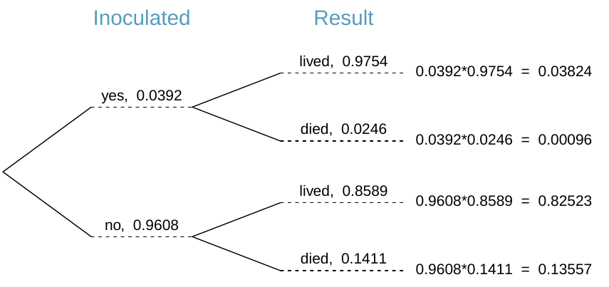
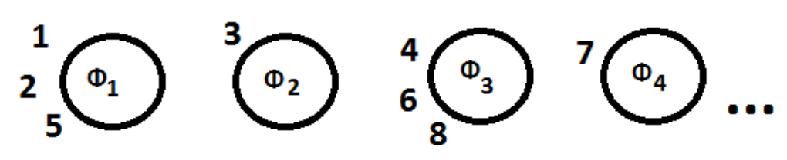
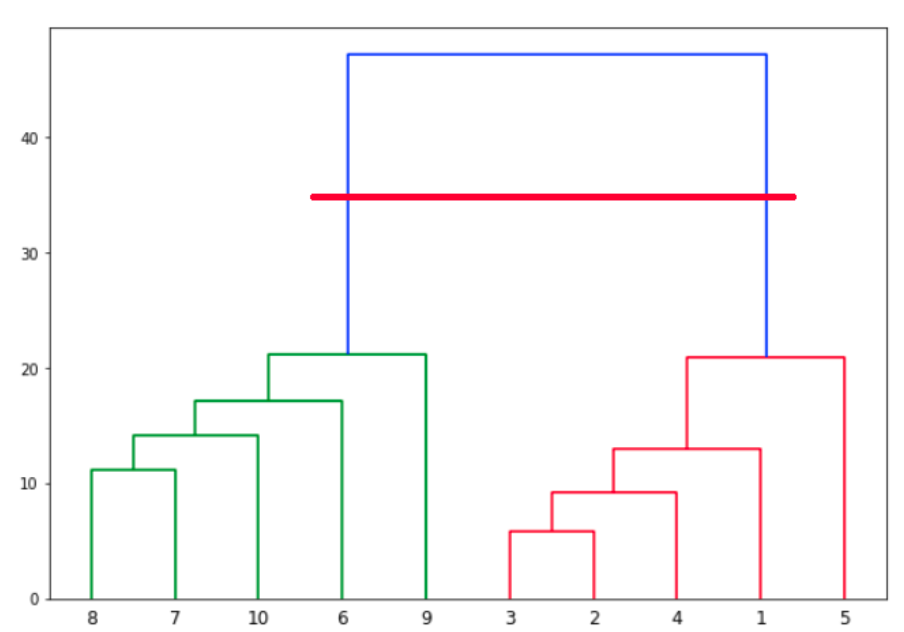

```{r setup, include=FALSE}
knitr::opts_chunk$set(echo = FALSE)
library(latexpdf)
library(data.table)
library(kableExtra)
library(magrittr)
```
#  Question 1  

## Sampling    

Statistical inference is based upon the assumption that it is possible to infer population attributes from a subset or sample of the population (Guttag, 2013).  The objective in data sampling is to select a sample that is representative of the population.   There are two types of error that can occur:  

* Sampling Error  
    This results from chance differences between samples.  
* Sampling Bias  
    When there is bias in the sampling process, inferences drawn from such a biased sample will not reflect the true situation.  

### Sampling Bias

Types of sampling bias are:  

1. Sampling Framing Error  
This happens when the sample frame does not contain a group or section of the population.  For instance, in 1936, Readers Digest did a survey on the US Presidential election.  However, there was recession in America at the time and only wealthy people were buying their publication.  The majority of voters were left out of the sample frame!

2. Convenience Bias  
A sampler may be lazy and select subjects that are readily available.  This often occurs in Psychology Departments where the researchers only consider student who are close by on campus.  

3. Judgment Bias  
This occurs when someone considered an expert selects the sample.  Samples will be subjective to that expert.  

4. Size Bias  
There may be a tendency of favour subjects from a large group such as those from a geographical area or classroom size.

5. Self-selection Bias  
Those with strong opinions are more likely to respond to surveys that those who are disinterested.

7. Non-response Bias  
There are individuals in a population who do not wish to or who cannot be recorded.  The classic example is when the RAF checked flak damage on airplanes (Guttag, 2013).   They wanted to know what areas of the plane needed strengthening from flak.  However, they could not include those planes that has been shoot down which were the ones that most flak damage.  

8. Questionnaire Bias  
How a surveyor expresses a question can solicit a particular response.  

9. Contrary Response Bias    
A person may record an option opposite to their true opinion or behaviour.  For example, they may not wish to reveal that they are a binge drinker.  

### Reducing Sampling Bias  
1. Randomisation    
Randomisation is the primary method to avoid bias in samples.  In a simple random sample, all possible samples have equal probability of selection.   So in a population of 250 customers, 25 are selected at random to make up a sample.

2. Systematic Sampling    
This uses a jump value, j, to select every jth  individual and a random point at which to start sampling.   The jump value is the population size divided by the sample size.  So, in a population of  25 subjects, selecting every 5th and starting at 14 gives:  
14, 19, 24, 4, 9.    
Note that certain subjects will never be selected.  

In finance, an auditor wishes to validate all the cheques that a company made in a single year.  There are 300 cheques (population) and the auditor sets a sample size of 60.  So the jump value is:  
$$ j = \frac{ \lvert population \rvert } {n} = 5 $$
Therefore, starting at a random point, the auditor evaluates every 5th cheque.   Assuming that there there no errors and given the sample of 60 cheques, then there is a 95% confidence level that all cheques are correct, according to Investopedia (Tuovila, 2020).

3. Stratified Sampling  
This involves identifying groups or strata in a population and ensuring that there are representatives from each strata in the sample.  The number of individuals in the sample from a particular strata is determined by the relative size of that strata.  

## Decision tree, Information gain and Entropy

A decision tree mimics the way that humans make decisions.  A particular entity has a number of characteristics and a person decides which characteristic to select.  
A decision tree models such entities as random variables which take on a fixed set of values or attributes.  They are represented by nodes in the tree with inward and outward branches.  Structurally, a decision tree consists of:  

* A root node, which has no inward branch and has two or more outward branches.
* Internal nodes have one inward branch and two or more outward branches.
* Leaf nodes assign a class label.

When applying decision trees to classification, there is a single target variable.  Assigning a class label to the target occurs as a result of making decisions on the variables or features related to the target.

In order to construct a decision tree, it is necessary to consider both probability and entropy accruing to a particular decision.   

### Decision Trees and Probability

Data from the Smallpox outbreak in Boston in 1721 records inoculations and survival rates (Diez, Cetinkaya-Rundel and Barr, 2015).


\begin{center}
Figure 1.  Probability of inoculation and survival  
\end{center}

The proportional number of people in  each group gives the probability of inoculation and survival.  Emanating from the root node, there was a 0.392 probability of being inoculated and 0.9608 of not being inoculated.  At the next level are the probabilities of living or death.   Figure 1 is a specific type of decision tree dealing with contingent variables.

### Decision Trees and Entropy

In a more general case, there are many features, each with its own set of attributes.  It is worth noting that an attribute could be a numerical value, as in the case of a threshold.   For classification, the order in which these features are inspected and decided upon is important.  To be most effective,  it is necessary to inspect first the feature that gives the most information.  This process repeats recursively for the feature gives most information at the next level.   

Entropy is a means of assessing the information gained from a particular feature.  It is somewhat contrary to information gain in that it measures the tendency towards disorder or the randomness in a system.   In information theory, entropy is a measure of the randomness or ‘impurity’ in a random variable ($S$) with a fixed set of attributes ($k$):
$$ E(S) = \sum_k  -p_k log_2 (p_k) $$
where $p_k$ is the probability that $S$ has the $k^{th}$ attribute.

When a decision is made at a particular node, there is an increase in information about the system.  The information gain where $P$ is the parent node and $C$ is the child node is given by:  
$$ IG(P, C) = E(P) \texttt{-} E(P \vert C) $$
In effect, information gain measures the reduction in uncertainty because there is greater knowledge about the system.

The steps for constructing a decision tree are:  

1. Calculate the entropy of the target variable, $E(T)$.
2. Sum the entropy of each attribute of a feature/node in the tree.
3. Calculate the entropy of a node from the entropy of each attribute weighted by the probability of that attribute, $E(N)$.
4. Calculate the information gained from that node.  
    $$ IG = E(T) - E(N) $$
5. Repeat for each node in the tree.
6. Select the node that gives the greatest information gain.

## Approaches to Clustering

### Chinese Restaurant Algorithm
The Chinese Restaurant Process (CRP) is a method of modeling a probability mass function where the random variable can have an infinite number of values.   There are an infinite number of tables in this metaphorical restaurant.   Initially, all tables are unoccupied and customer 1 enters and sits at a table.  As more customers enter, the probability of customer $i$   

* sitting at an occupied table $k \propto$ number of customers at that table
* sitting at an unoccupied table $\propto \alpha$  
where $\alpha$ is a “dispersion parameter”.

Consider the following simple example (Glen, 2020).


\begin{center} 
Figure 2.  Customers sitting at tables
\end{center}

Customers 1, 3, 4 and 7 sat at empty tables while the remaining customers sat at occupied tables.  We can describe this with a vector of table assignments, where the index refers to the $i^{th}$ customer (Navarro and Perfors, 2018).
$$ z = (1, 1, 2, 3, 1, 3, 4, 3) $$
This implies a counts vector that gives the number of customers at a given table.  Let $K$ be the total number of occupied tables.  Then  
$$ n = (3, 1, 3, 1)$$  
There are $N = 8$ customers sitting at tables.  The probability that customer 9 sits at the $k^{th}$ table is proportional to the number of people at that table ($n_k$):
$$ P(z_{9} = k \vert \textbf{n} )  = \frac{n_k}{N + \alpha}$$

In this case, the actual probabilities are:  

- table 1: $\frac{3}{8 + \alpha}$  
- table 2: $\frac{1}{8 + \alpha}$  
- table 3: $\frac{3}{8 + \alpha}$  
- table 4: $\frac{1}{8 + \alpha}$  
- unoccupied table: $\frac{\alpha}{8 + \alpha}$  

The principle at work here is that, as new customers enter, they are more likely to sit at occupied tables.   This algorithm is useful for clustering where data points (customers) are assigned to clusters (tables).   Applications of the CRP could be in predicting transactions made by customers or   demand among investors for existing or future stock offerings.

### Agglomerative Hierarchical Clustering

Clustering is a type of unsupervised learning that is particularly useful for high dimensional data.  The objective of clustering is to combine things that are close.  It is necessary to:   

1. Define closeness and formulate a distance metric.  
2. Specify how to group items.  
3. Provide a means of visualising groupings.  This is usually a tree diagram showing how items were merged together.  
4. Set the boundary for groupings.  

The two approaches to hierarchical clustering are agglomerative and divisive.  The agglomerative process works bottom up by selecting to two closest items.  It puts these together thus merging them into a new point or cluster.  The process repeats by finding the next closest items.  Eventually, all the small clusters combine into one big cluster.  

Divisive clustering is top down and starts by treating all points as a single large cluster.  It then separates this into smaller clusters.

__Closeness__  
For a continuous variable, closeness can be euclidean distance, correlation or another similarity measure.   
Manhattan distance measures closeness for discrete variables.    
In each case, it is important to select a measure that in appropriate to the context.  

Given two points $(x_1, y_1)$ and $(x_2, y_2)$  

$$ d_{euclidean} = \sqrt{(x_1-x_2)^2 + (y_1-y_2)^2} $$ and

$$ d_{manhattan} = |x_1-x_2| + |y_1-y_2| $$
__Groupings__  

Figure 3 is a dendrogram displaying how points 1 to 10 were combined to form small clusters and larger clusters (Malik, 2016).  The y-axis represents the distance between the groups divided at that point.  At the low level, there are the green and orange groupings.  Then there is the two large groupings represented by the blue vertical lines.  The position of the red horizontal line is a threshold that specifies what groupings are considered as clusters.  In figure 3, there are two large clusters.  If the horizontal line were drawn lower down the vertical axis at position 20, there would be four smaller clusters.


{width=75%}
\begin{center}
Figure 3.  Dendrogram for 10 data points
\end{center}

  
## References

Diez, D., Cetinkaya-Rundel, M. and Barr, C. (2015) OpenIntro Statistics. 3rd ed. Openintro.

Glen, S. (2020) Chinese Restaurant Process: Simple Definition & Example. StatisticsHowTo.com. Available at: https://www.statisticshowto.com/chinese-restaurant-process/ (Accessed: 6 January 2021).

Guttag, J. (2013) Introduction to Computation and Programming Using Python. MIT Press.

Malik, U. (2016) Hierarchical Clustering with Python and Scikit-Learn. Stack Abuse. Available at: https://stackabuse.com/hierarchical-clustering-with-python-and-scikit-learn/ (Accessed: 6 January 2021).

Navarro, D. and Perfors, A. (2018) The Chinese restaurant process. Available at: http://compcogsci-3016.djnavarro.net/technote_chineserestaurantprocesses.pdf (Accessed: 6 January 2021).

Tuovila, A. (2020) Sampling, Investopedia.com. Available at: https://www.investopedia.com/terms/s/sampling.asp (Accessed: 5 January 2021).

